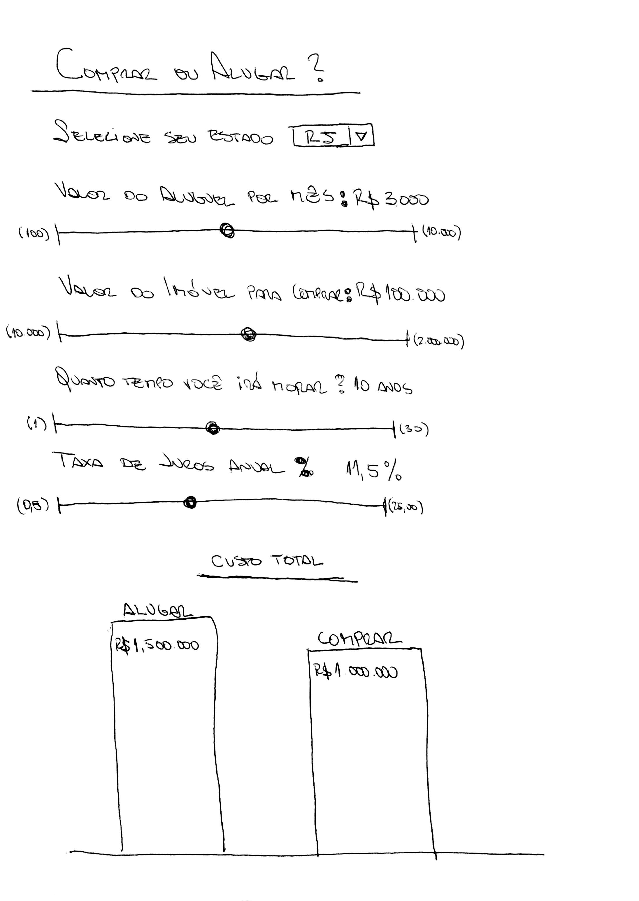

# Desafio OLX Imóveis

Construa uma SPA interativa utilizando **ReactJS** para ajudar o usuário a decidir se deve comprar ou alugar um imóvel.

Utilize essa página como referência (o que você deve construir é uma versão bem simplificada disso): http://www.trulia.com/rent_vs_buy/

## Requisitos

*Os valores inferiores e superiores de cada range aparece entre parênteses no mockup, mas não deve ser visível ao usuário*

Os parâmetros de entrada são:
* Valor do aluguel mensal (R$) 1
* Valor do imóvel para comprar (R$) 2
* Quanto tempo você irá morar (anos) *(Default: 10 anos)*
* Taxa de juros anual (%) *(Default: 11,5%)*

Com esses parâmetros, você deve calcular o **valor total** de cada tipo de investimento ao fim do período determinado (diferente do Trulia), utilizando uma fórmula de juros compostos. O total deve ser renderizado como um gráfico de barras simples que deve reagir ao input do usuário.

Você pode usar essa biblioteca para ajudar no cálculo dos juros compostos do aluguel (já presente no `package.json`):
https://github.com/kfiku/InterestJS

### 1,2 *Bônus*: valores default por estado

Os valores para aluguel mensal e valor de compra podem ser definidos a partir da seleção de um dropdown de estado. Os dados para esses valores estão em: `/api/valores.json`

### Automação

Dependências do projeto devem ser instaladas com:

    npm install

A aplicação deve ser executada com:

    npm start

*Bônus:* Testes automatizados devem ser executados com:

    npm test
